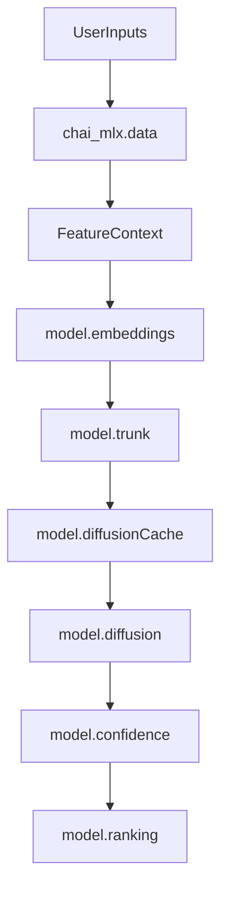

# Architecture

`chai_mlx` is organized around four responsibilities:

- `chai_mlx.data`: frontend-independent feature contexts plus adapters such as `featurize(...)` and `featurize_fasta(...)`
- `chai_mlx.model`: the public model pipeline and the major Chai stages (`ChaiMLX`, trunk, diffusion, confidence, ranking)
- `chai_mlx.nn`: reusable MLX modules and optional kernel-backed building blocks
- `chai_mlx.io.weights`: weight export, conversion, loading, and validation utilities

## Package map

```text
chai_mlx/
  __init__.py
  config.py
  utils.py
  data/
    __init__.py
    featurize.py
    types.py
  model/
    __init__.py
    api.py
    embeddings.py
    trunk.py
    diffusion.py
    confidence.py
    ranking.py
  nn/
    __init__.py
    layers/
    kernels/
  io/
    __init__.py
    weights/
```

## Data flow



## Practical navigation

- Start with `chai_mlx.__init__` for the public surface.
- Read `chai_mlx.model.api` if you want the end-to-end folding flow.
- Read `chai_mlx.data.featurize` and `chai_mlx.data.types` if you want to understand inputs.
- Read `chai_mlx.nn.layers` and `chai_mlx.nn.kernels` only when you are working on model internals or performance work.
- Read `chai_mlx.io.weights` when you need to export or validate weights against upstream TorchScript artifacts.
